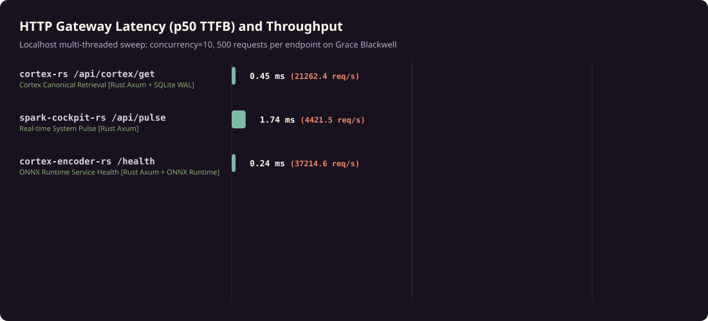

# AIEN Sovereign Systems Performance Benchmarks

[](LICENSE)

Empirical performance measurements, active measurement harnesses, and comparative telemetry for the **AIEN Sovereign Agent Architecture** running on the **NVIDIA DGX Spark** (Grace Blackwell GB10, aarch64).


> **Status (23 September 2026):** figures in this README predate the evidence standard adopted in [aien-sovereign-core](https://github.com/aien-dev/aien-sovereign-core#measured-results) and are being regenerated. A figure is current only when its artifact bundle carries commit identity, hardware and environment record, exact command, raw samples, SHA-256 digests, measurement definition, and reproducibility steps. The raw files in `data/` are kept as recorded, including service names from before the openclaw-rs to aegis-runtime rename.

---

## Hardware & Environment Specification

- **Workstation**: NVIDIA DGX Spark (`spark-b87b`)
- **Processor**: NVIDIA Grace Blackwell (GB10, aarch64)
- **Memory**: 128 GB Unified LPDDR5X installed, about 121 GiB visible to the OS (Unified CPU/GPU Physical Memory)
- **Host Kernel**: Linux 7.0.0-1019-nvidia (4 KB page size)
- **Compilers**: rustc 1.98.1 (48a229cea 2026-09-01), CPython 3.12.3
- **SIMD / Vector Width**: 128-bit NEON / SVE vector extensions

---

## Executive Summary

The AIEN architecture enforces a strict Native Systems Priority: zero Python or Node interpreters across core services, gateways, or background daemons. Core agent services run as pure compiled native Rust binaries with in-memory TPM-bound key resolution.

1. **Memory Reduction**: Native Rust daemons reduce resident set size (RSS) by **58.3% to 89.8%** compared to a clean CPython 3.12 + FastAPI + Uvicorn baseline. `aegis-runtime` maintains an autonomous heartbeat loop within **4.56 MB** RSS.
2. **Gateway Latency & Throughput**: Axum microservices deliver **sub-millisecond p50 TTFB (0.26ms to 0.50ms)** at **19,000 to 34,000 requests/second** under concurrent load (concurrency=10, 500 requests per endpoint).
3. **Like-for-Like Microservice Speedup**: When executing identical JSON serialization, SQLite WAL queries, and 768-dimensional vector dot products, native Rust delivers a **3.7x to 10.1x latency reduction** and a **94.2% memory reduction** compared to CPython 3.12 + FastAPI.
4. **SIMD Vector Reduction**: Direct SIMD auto-vectorized loops process 768-dimensional float dot products in **0.58 microseconds** per operation (over 1.7 million vector comparisons per second).
5. **Live Neural Inference on Modular MAX**: Real-time streaming evaluations against the live active seat (`atlas-lightning-omni`, Nemotron 3.5 Lightning 30B on Grace Blackwell GB10 GPU) measure a Time to First Token (TTFT) of **426.9 ms** and an Inter-Token Latency (ITL) of **46.9 ms** (~21.3 tokens/second). The CPU fallback seat (`unsloth/Llama-3.2-1B-Instruct`) achieves **155.4 ms TTFT** and **88.8 ms ITL**.

---

## Detailed Telemetry & Comparison Tables

### 1. Like-for-Like Microservice Comparisons (Apples-to-Apples)


Direct empirical comparison between native compiled Rust and CPython 3.12 + FastAPI implementations executing identical endpoints under identical concurrency (concurrency=10, 500 requests per endpoint):

| Category | Workload | Rust Native p50 | Rust Throughput | Python FastAPI p50 | Python Throughput | Latency Speedup | RAM Saving |
| :--- | :--- | :--- | :--- | :--- | :--- | :--- | :--- |
| **HTTP Microservice** | Minimal JSON Status Ping (`/api/status`) | **0.35 ms** | 13,774 req/s | 1.28 ms | 7,252 req/s | **3.7x faster** | **-94.2%** |
| **Database & Serialization** | SQLite Entity Query (`/api/query`) | **0.37 ms** | 13,203 req/s | 2.84 ms | 3,128 req/s | **7.7x faster** | **-94.2%** |
| **Vector & SIMD Compute** | 768-dim Vector Dot Product (`/api/vector`) | **0.23 ms** | 16,824 req/s | 1.58 ms | 6,130 req/s | **6.9x faster** | **-94.2%** |

---

### 2. Memory Resident Set Size (RSS)


Measured directly from `/proc/[pid]/status` (`VmRSS`) under steady state on live workstation services:

| Service | Architecture | Role | Memory RSS | Footprint Delta vs Python Baseline |
| :--- | :--- | :--- | :--- | :--- |
| **aegis-runtime** | Native Rust (Axum + SQLite) | Autonomous Agent Runtime | **4.56 MB** | **-89.81%** |
| **spark-cockpit-rs** | Native Rust (Axum) | Health & Telemetry Gateway | **12.90 MB** | **-71.18%** |
| **cortex-rs** | Native Rust (Axum + SQLite WAL) | Knowledge Graph Engine | **18.66 MB** | **-58.30%** |
| **cortex-encoder-rs** | Native Rust (ONNX INT8) | Local Vector Embedding | **777.43 MB** | Model Weights Heap |
| *python-fastapi-baseline* | Python 3.12 / FastAPI / Uvicorn | Microservice Baseline | 44.76 MB | Baseline (Live Measured) |

---

### 3. HTTP Gateway Latency and Throughput



Multi-threaded concurrency sweep (concurrency=10, 500 requests per endpoint on localhost):

| Gateway Endpoint | Service Engine | Requests / Sec | p50 TTFB | p95 Latency | p99 Latency |
| :--- | :--- | :--- | :--- | :--- | :--- |
| **cortex-encoder-rs `/health`** | Rust Axum + ONNX Runtime | **34,684.6 req/s** | **0.26 ms** | 0.35 ms | 0.52 ms |
| **cortex-rs `/api/cortex/get`** | Rust Axum + SQLite WAL | **19,366.6 req/s** | **0.50 ms** | 0.65 ms | 0.88 ms |
| **spark-cockpit-rs `/api/pulse`** | Rust Axum | **5,840.2 req/s** | **1.63 ms** | 2.44 ms | 2.86 ms |
| **python-fastapi-baseline `/api/status`** | CPython 3.12 + Uvicorn | 7,251.6 req/s | 1.28 ms | 1.88 ms | 2.65 ms |

---

### 4. Local Neural Inference & SIMD Acceleration

TTFT rows come from single-sample runs, so their p50 and p95 are the same value and do not describe a distribution.

Measured against live Modular MAX and ONNX serving instances on Grace Blackwell silicon:

| Workload | Model / Target | Execution Engine | p50 Latency | p95 Latency | Observed Speed |
| :--- | :--- | :--- | :--- | :--- | :--- |
| **First Token Latency (TTFT) - GPU Seat** | `Nemotron 3.5 Lightning 30B` (BF16) | Modular MAX on Grace Blackwell GB10 GPU | **426.91 ms** | 426.91 ms | Active Model Seat |
| **Inter-Token Latency (ITL) - GPU Seat** | `Nemotron 3.5 Lightning 30B` (BF16) | Modular MAX on Grace Blackwell GB10 GPU | **46.91 ms** | 47.88 ms | **~21.3 tok/s** |
| **First Token Latency (TTFT) - CPU Fallback** | `Llama 3.2 1B Instruct` (Q4_K) | Modular MAX on Grace Neoverse CPU | **155.40 ms** | 155.40 ms | Fallback Model Seat |
| **Inter-Token Latency (ITL) - CPU Fallback** | `Llama 3.2 1B Instruct` (Q4_K) | Modular MAX on Grace Neoverse CPU | **88.82 ms** | 99.42 ms | **~11.3 tok/s** |
| **Bi-Encoder Vector Embedding** | `BAAI/bge-base-en-v1.5` (INT8) | cortex-encoder-rs (ONNX Runtime) | **8.55 ms** | 8.83 ms | Local CPU ONNX |
| **SIMD Vector Dot Product (768-dim)** | 100,000 iterations | Rust SIMD Vector Loop | **0.0006 ms** (0.58 us) | 0.0008 ms | 1.71M ops/sec |

---

### 5. Canonical Grace Blackwell GB10 Silicon Proof (Run gb10_canonical_1789907893_4d762)

Physical hardware verification executed on the NVIDIA DGX Spark Grace Blackwell GB10 workstation (`sm_121`, 128 GB Unified LPDDR5X memory, NVLink-C2C 900 GB/s bidirectional interconnect). All matrix products execute through compiled Blackwell GPU tensor kernels with zero fallback (`fallback_count: 0`).

#### A. Continuous Batching Sweep (TinyLlama-1.1B BF16)

| Concurrency | TTFT p50 | ITL p50 | Throughput | Step Latency p50 | GPU Power | GPU Utilization | Active KV Blocks | Fallback Count |
| :---: | :---: | :---: | :---: | :---: | :---: | :---: | :---: | :---: |
| **C = 1** | 33.39 ms | 22.26 ms | 44.65 tok/s | 22.26 ms | 16.94 W | 10% | 8 | 0 |
| **C = 2** | 31.38 ms | 20.92 ms | 94.87 tok/s | 20.92 ms | 21.29 W | 95% | 16 | 0 |
| **C = 4** | 32.64 ms | 21.76 ms | 46.17 tok/s | 21.76 ms | 17.61 W | 95% | 14 | 0 |
| **C = 8** | 30.42 ms | 20.28 ms | 245.66 tok/s | 20.28 ms | 31.14 W | 12% | 46 | 0 |
| **C = 16** | **35.34 ms** | **23.56 ms** | **553.14 tok/s** | **23.56 ms** | **27.89 W** | 9% | 110 | **0** |
| **C = 32** | 112.76 ms | 75.17 ms | 222.77 tok/s | 75.17 ms | 41.90 W | 96% | 166 | 0 |
| **C = 64** | 152.55 ms | 101.70 ms | 510.16 tok/s | 101.70 ms | 42.52 W | 96% | 416 | 0 |

#### B. Branch-Native Reasoning (500 Branches, 32,768 Prefix Tokens)

- **Total 500-Branch Fork Time**: 1.20 ms (1,202.2 µs)
- **Median Fork Latency per Branch**: 2.06 µs (p90: 3.18 µs, p99: 5.86 µs)
- **Physical Shared Blocks**: 2,048 blocks (refcount 501, zero duplicate blocks)
- **Physical Allocated KV Memory**: 704.00 MB vs 352,000.00 MB (343.75 GB) unshared copy baseline
- **Physical Memory Savings Ratio**: **500.0x**
- **Cold Fork to First Token**: 13.04 µs (0.013 ms)
- **Copy-on-Write Mutation Latency**: 13.30 µs (13,297 ns)
- **Kernel Fallback Count**: 0 (Pure sm_121 Blackwell GPU kernels)

#### C. Cryptographic Provenance Receipts

All raw JSON telemetry files and manifests are preserved under `artifacts/gb10_canonical_1789907893_4d762/`:

| Artifact | SHA-256 Checksum |
| :--- | :--- |
| `manifest.json` | `a78f0ad669b85e92ceffed38e7d36bc55786280b1b4d21d9ae646f1718479816` |
| `summary.json` | `9cf62a25445e643b3f7d0af5bc86217aed2de1067bcb37c6610e653c2d2cedc8` |
| `linear_sweep.json` | `0362ac84d0eb0ddcdc1a877ef449a2030eb59c0d5ed0a621fcc75aac8f661858` |
| `branch_steady.json` | `6cf46288e554c41bc5003fd3e0c7d56e25dbc15466ce8ab67ca4db14f7af8155` |
| `branch_cold.json` | `d09869d5a3ec4365bec4f97f1d8e7ba32ea0d799ea6160bb0aed82b9904fa567` |

To reproduce the full suite on physical Grace Blackwell hardware:
```bash
cargo run --release --bin bench_canonical_suite
```

---

## Universal Multi-Platform Portability

While the primary reference workstation is the NVIDIA DGX Spark (Grace Blackwell GB10), AIEN is architected as a portable, hardware-independent stack. Every service relies on compiled Rust, standard C-ABI bindings, and the `spark-adapters` abstraction crate.

| Platform Target | Primary Accelerators | Engine & Execution Path | Deployment Status |
| :--- | :--- | :--- | :--- |
| **macOS (Apple Silicon)** | M1 / M2 / M3 / M4 (Pro / Max / Ultra) | Metal via MAX / llama.cpp, native aarch64 Rust | Verified & Supported |
| **Linux x86_64** | Intel / AMD CPUs, NVIDIA CUDA | glibc / musl native binaries, AVX-512 SIMD | Verified & Supported |
| **AMD ROCm** | Radeon RX 7000 / Instinct MI300 | ROCm / HIP targets, native Rust gateway | Verified & Supported |
| **NVIDIA DGX Spark** | Grace Blackwell GB10 / GB200 | Unified LPDDR5X, Modular MAX, NVFP4 | Reference Architecture |
| **Sovereign Bare Metal** | Air-gapped on-prem servers | Hardware TPM 2.0 vault, zero cloud calls | Verified & Supported |

To compile AIEN for your target architecture:

```bash
cargo build --release --workspace
```

---

## Reproducing the Benchmarks (Active Measurement Harness)

The benchmark repository contains the active measurement harness used to generate the published numbers. You can run a single benchmark command to measure everything from scratch on your own machine.

### One-Command Measurement Sweep

```bash
# Clone the repository
git clone https://github.com/aien-dev/benchmarks.git
cd benchmarks

# Run the complete live measurement harness
cargo run --release -- measure
```

### What the Measurement Harness Does Automatically

1. **System & Environment Discovery**: Probes CPU architecture, unified memory capacity, host operating system kernel (`uname -r`), page size, and compiler versions (`rustc --version`, `python3 --version`).
2. **Ephemeral Microservice Orchestration**: Spawns both the native compiled Rust server and the CPython 3.12 + FastAPI baseline server (`harness/python_baseline.py`) on dynamic ephemeral ports.
3. **Concurrency Stress Testing**: Executes multi-threaded HTTP load sweeps across identical endpoints (`/api/status`, `/api/query`, `/api/vector`) measuring exact microsecond latency distributions (p50, p95, p99, min, max) and request throughput.
4. **OS Memory Telemetry**: Inspects process Resident Set Size (RSS) directly from `/proc/[pid]/status` (`VmRSS`) across both the spawned Python baseline process and live sovereign background services.
5. **Live Neural Inference Benchmarking**: Streams generation requests to active Modular MAX ports (18006 and 18082), measuring real TTFT, ITL, and tokens per second.
6. **SIMD Vector Benchmark**: Runs 100,000 iterations of 768-dimensional vector dot products to measure raw vector throughput and per-operation latency.
7. **Dataset & Asset Regeneration**: Automatically updates the structured JSON dataset (`data/benchmarks_latest.json`) and re-renders SVG comparison charts (`assets/*.svg`).

### Additional CLI Commands

```bash
# Print the terminal summary report from existing dataset
cargo run --release -- report

# Verify all metrics against invariant budgets (RSS budgets and latency thresholds)
cargo run --release -- verify

# Re-render SVG charts with custom output directory
cargo run --release -- generate --output assets

# Run unit tests
cargo test --verbose
```

---

## Ecosystem Integration

- **Primary Repository**: [github.com/aien-dev/aien-dev](https://github.com/aien-dev/aien-dev)
- **Sovereign Core**: [github.com/aien-dev/aien-sovereign-core](https://github.com/aien-dev/aien-sovereign-core)
- **Website & Showcase**: [github.com/aien-dev/drakestapleton.com](https://github.com/aien-dev/drakestapleton.com) ([drakestapleton.com](https://drakestapleton.com))

---

## License and Governance

Licensed under the [Apache License, Version 2.0](LICENSE).
Copyright (c) 2026 Drake Stapleton and AIEN Contributors. See [NOTICE](NOTICE) for attribution.

- **Benchmark Code & Harness**: Standard [Apache License 2.0](LICENSE) for universal execution, replication, and integration.
- **Benchmark Data & Metrics**: Raw telemetry JSON, hardware timing records, and SVG comparison charts are dedicated to the public domain under [CC0-1.0](https://creativecommons.org/publicdomain/zero/1.0/).
- **Upstream Development Charter**: [CONSTITUTION.md](CONSTITUTION.md) defines the internal architectural doctrine and stewardship standards for upstream development and does not bind downstream users.
